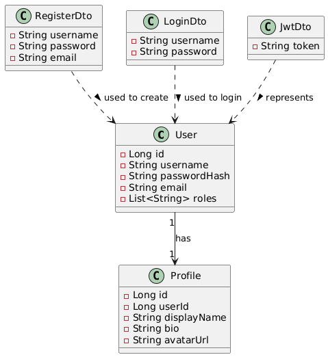

# Microservices ระบบสมาชิกด้วย Spring Boot + PostgreSQL + Eureka

ระบบนี้ออกแบบตามสถาปัตยกรรม Microservices โดยใช้ Spring Boot, Spring Cloud Eureka, PostgreSQL และ Docker Compose

## โครงสร้างโปรเจกต์

```
Microservices/
├── auth-service/           # จัดการ Authentication & JWT
├── user-service/           # จัดการโปรไฟล์ผู้ใช้
├── api-gateway/            # Gateway สำหรับ route API
├── discovery-service/      # Eureka Service Registry
├── docker-compose.yml      # สำหรับ run ทุก service ด้วย Docker
```

---

## Diagram ประกอบ

### Architecture Diagram
ระบบทำงานแบบ Microservices โดยมี Discovery Service และ Gateway คั่นกลาง


---

### Use Case Diagram
แสดงกรณีการใช้งานของผู้ใช้


---

### Class Diagram
แสดงโครงสร้างข้อมูลของระบบ Authentication และ User



---

## Auth Service

- `/register` – สมัครสมาชิกใหม่
- `/login` – เข้าสู่ระบบ รับ JWT
- ใช้ฐานข้อมูล `authdb` เก็บ user
- ส่ง Event แจ้ง `user-service` สร้างโปรไฟล์

## User Service

- `/users/me` – ดึงโปรไฟล์ผู้ใช้จาก userId
- `/users/me/update` – แก้ไขโปรไฟล์ เช่น bio, avatar
- ใช้ฐานข้อมูล `userdb`

## API Gateway

- route `/auth/**` ไปที่ `auth-service`
- route `/users/**` ไปที่ `user-service`

## Discovery Service (Eureka)

- ทำหน้าที่เก็บ register ของทุก service
- ให้ API Gateway เรียกใช้แบบ dynamic

---

## การใช้งานด้วย Docker

```bash
# Build และรันทุก service
docker compose up --build -d

# ดู log ทั้งหมด
docker compose logs -f
```

---

## เทคโนโลยีที่ใช้

- Java 21 + Spring Boot 3.5
- Spring Security + JWT
- Spring Cloud Eureka
- PostgreSQL + JPA
- Docker Compose

---

## ผู้พัฒนา

> พัฒนาโดย พ.อ.ท.อภิศักดิ์  แซ่ลิ้ม